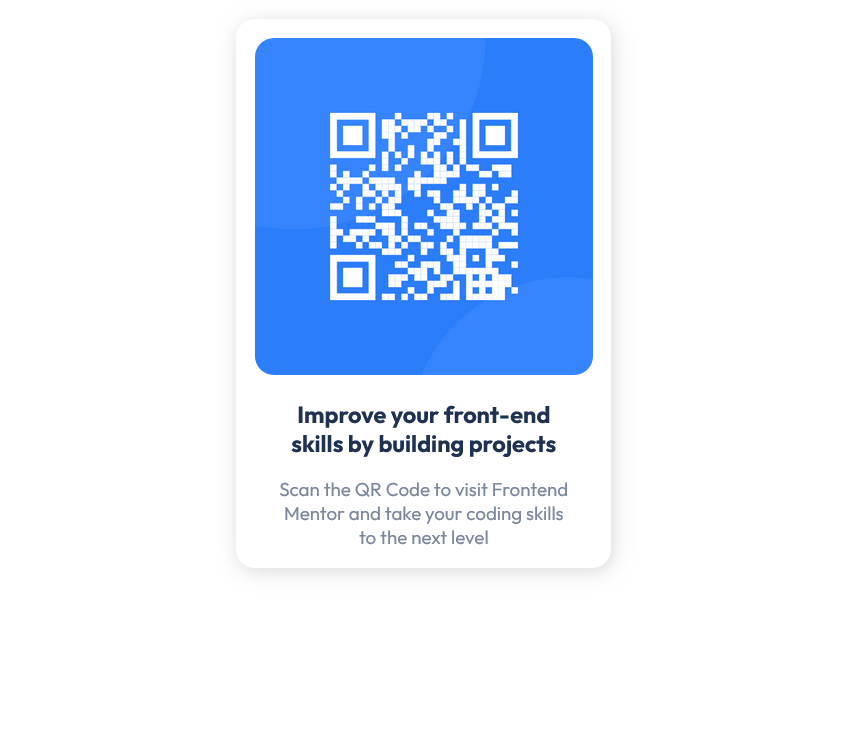

# Frontend Mentor - QR code component solution

This is a solution to the [QR code component challenge on Frontend Mentor](https://www.frontendmentor.io/challenges/qr-code-component-iux_sIO_H). Frontend Mentor challenges help you improve your coding skills by building realistic projects. 

## Table of contents

- [Screenshot](#screenshot)
- [Links](#links)
- [Author](#author)

## Screenshot

## Links

- Solution URL: [Add solution URL here](https://your-solution-url.com)
- Live Site URL: [Add live site URL here](https://your-live-site-url.com)

## Author
- Frontend Mentor - [@MWA-Waleed-Ahmed](https://www.frontendmentor.io/profile/MWA-Waleed-Ahmed)
- Twitter - [@MWA_WebDev](https://twitter.com/MWA_WebDev)
